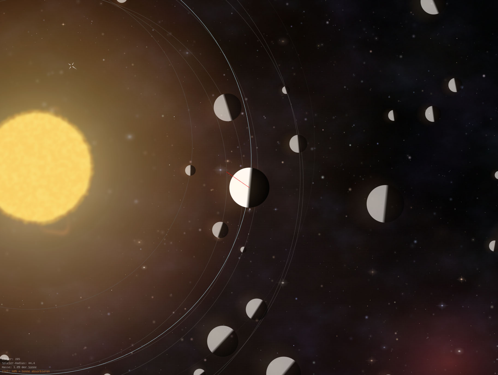

# Orbital

> The core principle of the game OSMOSE recreated in HTML/Javascript in a vibe coding playground.



## About

An orbital mechanics game where you control a celestial body orbiting a sun. Eject mass to maneuver, absorb other bodies to grow, and eventually consume the sun itself to become the new gravitational center.

## Play

Open `orbital.html` or the all-in-one standalone build at `dist/orbital-mono.html` in a browser.

**Controls:**
- <kbd>Click</kbd> to eject tiny mass amounts toward cursor to proell yourself (repeat faster clicks to eject more mass for more recoil – conservation of momentum)
- <kbd>Scroll</kbd> to zoom in and out
- Hold <kbd>Space</kbd> to speed up time

## Development

Modular architecture with separated concerns. See [`ARCHITECTURE.md`](ARCHITECTURE.md) for the full structure.

**Build monolithic version:**
```bash
node _build/assemble.js
```

## Tech Stack

- Pure HTML5 Canvas
- Vanilla JavaScript (no frameworks)
- Procedural generation (simplex noise, FBM)
- Keplerian orbit mechanics with simplified/gemoetric/2D mass gravity system
